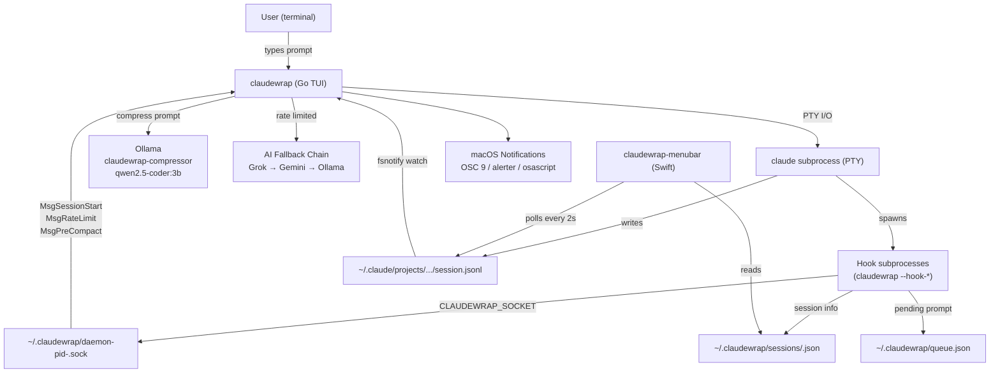
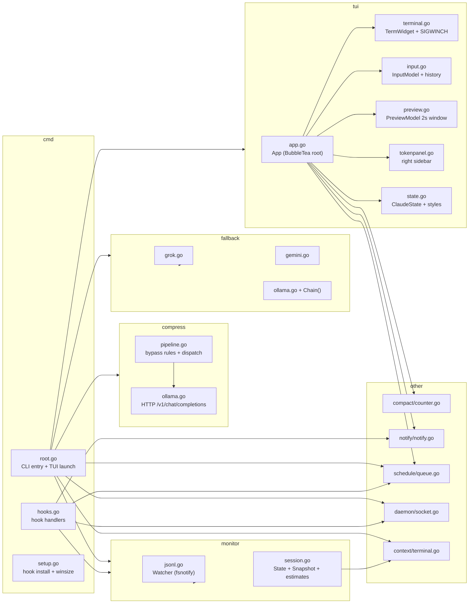
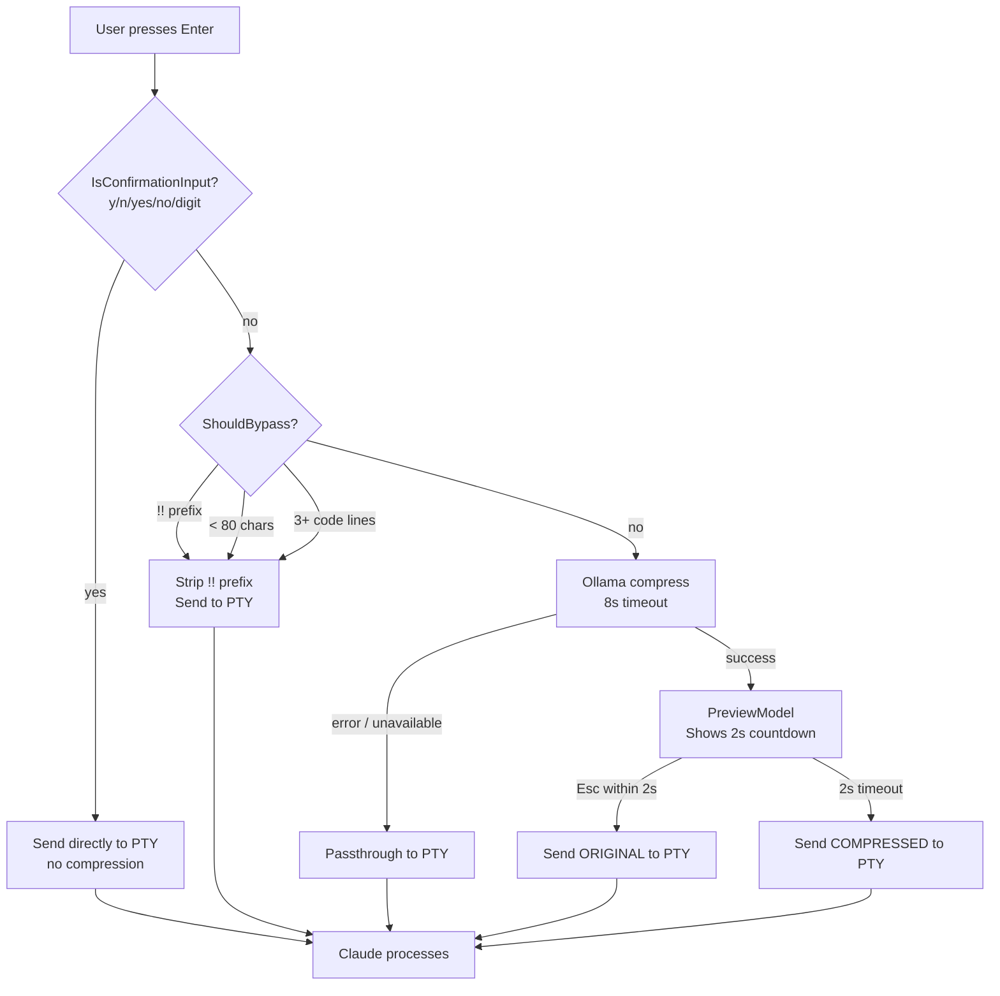
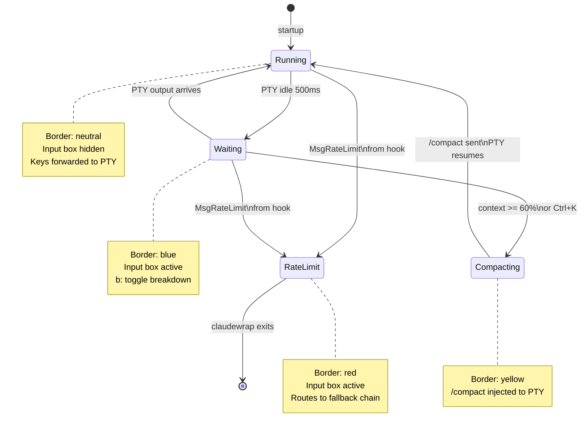
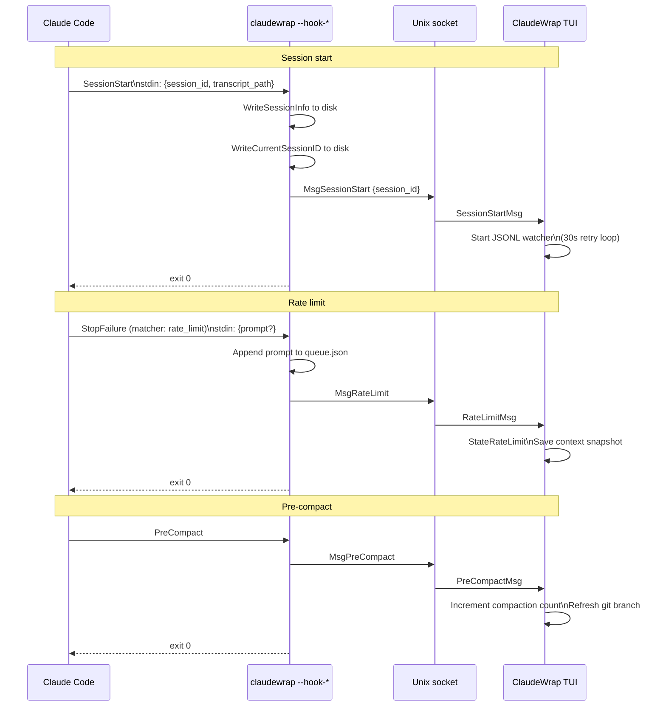
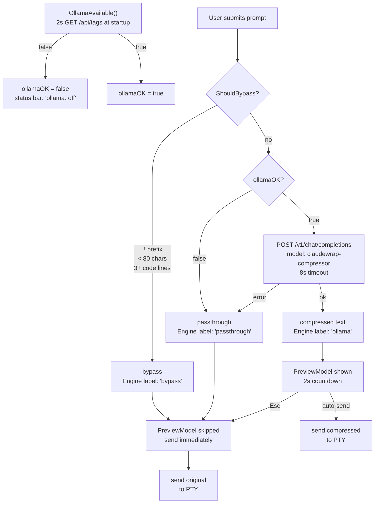
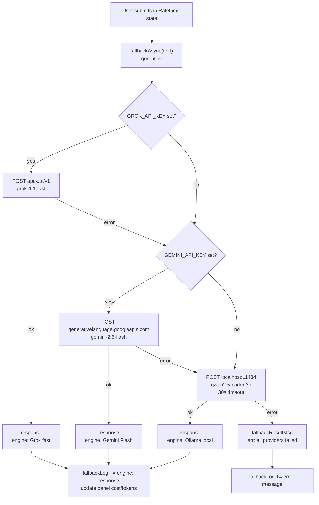
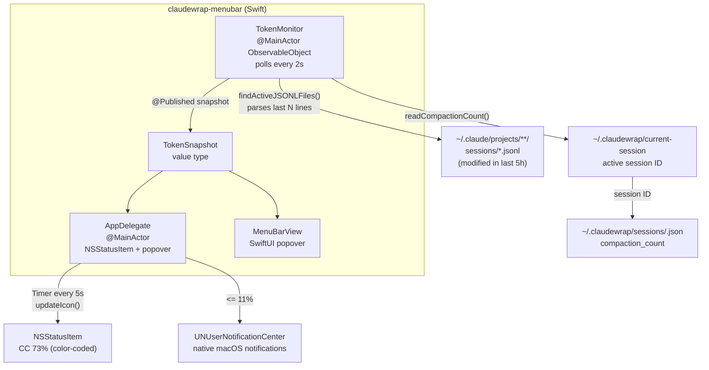

# ClaudeWrap — Architecture

ClaudeWrap is two programs: a Go CLI that wraps Claude Code in a TUI, and a Swift menubar companion that reads session data independently. They share no runtime state — the menubar polls files on disk.

---

## System overview



---

## Component 1 — CLI TUI (Go)

### Internal package map



---

## Prompt flow

Every prompt the user types goes through this pipeline before reaching Claude.



---

## State machine

The `ClaudeState` enum drives border color, input availability, and compaction timing.



---

## Hook system

Claude Code calls hooks as subprocesses. ClaudeWrap hooks are the same binary (`claudewrap`) dispatched by hidden flags.



### Socket rendezvous

The TUI needs hooks to find the right socket when multiple claudewrap instances are running (git worktrees, cmux claude-teams).

```
TUI process (PID 12345)
  └─ sets CLAUDEWRAP_SOCKET = ~/.claudewrap/daemon-pid-12345.sock
  └─ claude subprocess inherits the env var
       └─ hook subprocess also inherits it
            └─ hook reads CLAUDEWRAP_SOCKET → sends message to correct TUI
```

If `CLAUDEWRAP_SOCKET` is not set (out-of-process invocation), hooks fall back to reading `~/.claudewrap/current-session` and constructing the path from the stored session ID.

---

## JSONL data flow

Claude Code writes one JSON object per line to a session transcript file. ClaudeWrap tails it in real time.

```mermaid
flowchart LR
    CC["Claude Code\nwrites JSONL entries"]
    File["~/.claude/projects/.../\nsession.jsonl"]
    FN["fsnotify.Watcher\ndetects Write events"]
    ReadFrom["readFrom(offset)\nscans new bytes only"]
    State["monitor.State\nthread-safe accumulator"]
    Snap["StateSnapshot\nimmutable read copy"]
    TUI["BubbleTea\nStateUpdateMsg"]
    Panel["Token Panel\nre-renders"]

    CC -->|"append"| File
    File -->|"inotify event"| FN
    FN --> ReadFrom
    ReadFrom -->|"Entry{Type,Usage,...}"| State
    State -->|"Snapshot()"| Snap
    Snap -->|"StateUpdateMsg"| TUI
    TUI --> Panel
```



Each JSONL entry has this shape (simplified):

```json
{
  "type": "assistant",
  "timestamp": "2026-04-21T14:32:01Z",
  "message": {
    "usage": {
      "input_tokens": 41200,
      "output_tokens": 4030,
      "cache_read_input_tokens": 12400,
      "cache_creation_input_tokens": 800,
      "remaining_percentage": 72.4,
      "context_window": {
        "used_percentage": 61.2,
        "total_tokens": 200000,
        "used_tokens": 122400
      },
      "breakdown": {
        "claude_md": 8200,
        "tool_call_io": 4100,
        "mentioned_files": 3400,
        "extended_thinking": 1200,
        "conversation": 28000,
        "skill_activations": 330,
        "team_overhead": 450,
        "user_text": 20
      }
    }
  }
}
```

---

## Compression pipeline



---

## AI fallback chain

Activated when `StateRateLimit` — user prompts go to fallback instead of PTY.



---

## Reset time estimate

```
                  first_entry_time
                        │
                        ▼
           ┌────────────────────────┐
           │  IsPeakHour(now)?      │
           │  05:00–11:00 Pacific   │
           └────────────────────────┘
                  │          │
                 yes         no
                  │          │
                  ▼          ▼
            +2h 51m        +5h 00m
            (5h / 1.75)
                  │          │
                  └────┬─────┘
                       │
                  EstimatedReset
                  shown as "~Xh Ym (est.)"
```

The Swift menubar uses the same formula with the proper Pacific timezone via `Calendar`.

---

## Component 2 — Menubar app (Swift)



The menubar app never connects to the Unix socket. It reads JSONL and session files directly, which means it keeps working even if the TUI is not running.

---

## Data directory layout

```
~/.claudewrap/
│
├── daemon-pid-<PID>.sock          # TUI socket — deleted when TUI exits
│                                  # one per running claudewrap process
│
├── current-session                # plaintext session ID
│                                  # written by SessionStart hook
│                                  # read by: hooks (fallback), menubar app
│
├── sessions/
│   └── <session-uuid>.json        # SessionInfo: transcript_path, started_at,
│                                  #   compaction_count
│
├── queue.json                     # [{prompt, bypass, added_at}, ...]
│                                  # written by rate-limit hook
│                                  # replayed on next claudewrap start
│
└── context_<timestamp>.json       # TokenSnapshot at moment of rate limit:
                                   #   remaining_pct, used_tokens, total_tokens,
                                   #   estimated_reset, compaction_count
```

---

## Key design decisions

### Why PID-based sockets?

Multiple claudewrap instances (git worktrees, cmux claude-teams) must not share a socket. Using the TUI's PID as the socket name guarantees uniqueness. The PID is exported as `CLAUDEWRAP_SOCKET` before `claude` is started, so hook subprocesses inherit it without any coordination.

### Why intercept at Enter instead of using UserPromptSubmit hook?

`UserPromptSubmit` hooks cannot modify the prompt they receive (Claude Code issue #13912 — stdout is not read back by the host process). Intercepting keystrokes at the TUI input layer gives full control over what reaches the PTY, with no hook round-trip latency.

### Why retry the JSONL watcher for 30 seconds?

The `SessionStart` hook fires before Claude creates the transcript file. The watcher would fail immediately if it tried to open the file at hook time. The 30-second retry loop (1 attempt/second) handles the race condition without requiring any changes to Claude Code's hook firing order.

### Why does the menubar not use the socket?

Polling JSONL files directly makes the menubar independent of whether a TUI is running. It also means it naturally aggregates multiple sessions without any coordination protocol.
